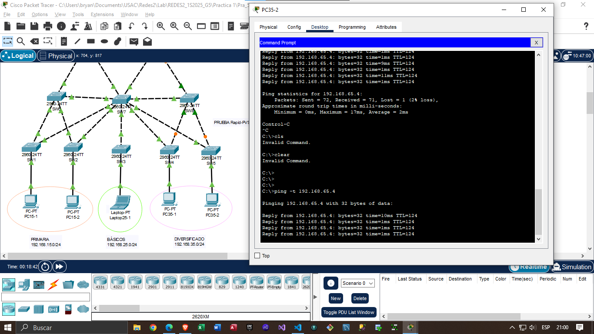
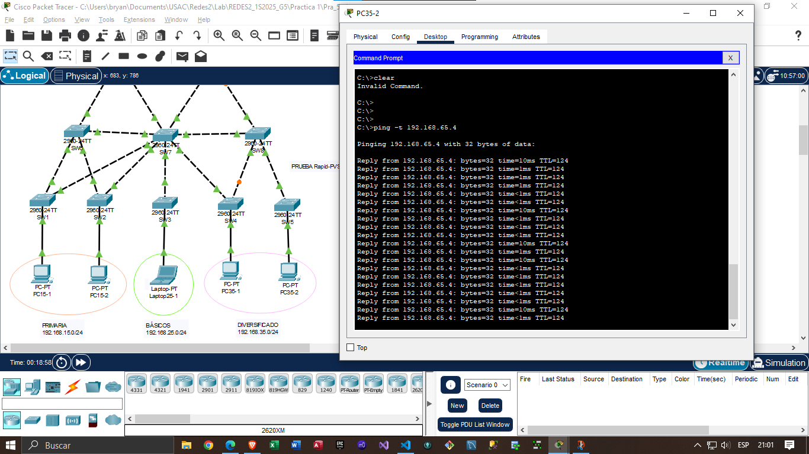
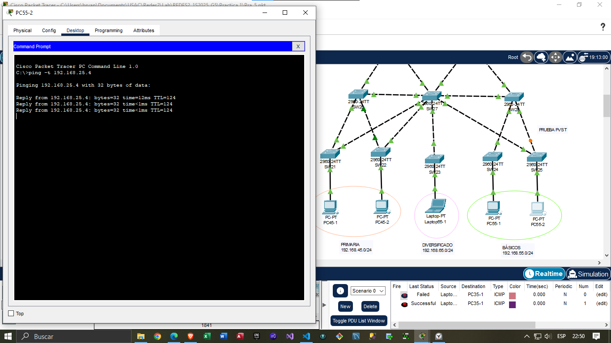
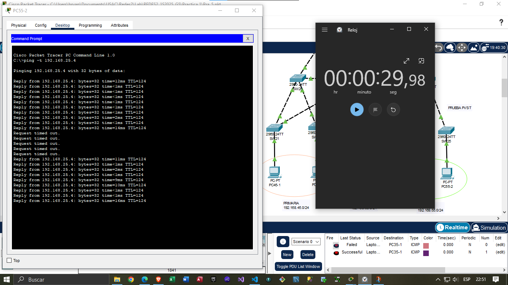

*Universidad de San Carlos de Guatemala*  
*Facultad de Ingenieria*  
*Escuela de Ciencias y Sistemas*  
*Redes De Computadoras 2*  
*Primer Semestre 2025*  
___
**202200048 - Christian Samuel Brán Mazariegos**  
**201908355 - Danny Hugo Bryan Tejaxún Pichiyá**  
**201612218 - Susan Pamela Herrera Monzón**  
___
## **Practica 1**
### 1. IP's

| Equipo | IP | Máscara de Subred | Gateway |
| - | - | - | - |
| `PC15-1`     | `192.168.15.2` | `255.255.255.0` | `192.168.15.1` |
| `PC15-2`     | `192.168.15.3` | `255.255.255.0` | `192.168.15.1` |
| `Laptop25-1` | `192.168.25.4` | `255.255.255.0` | `192.168.25.1` |
| `PC35-1`     | `192.168.35.5` | `255.255.255.0` | `192.168.35.1` |
| `PC35-2`     | `192.168.35.6` | `255.255.255.0` | `192.168.35.1` |
| `PC45-1`     | `192.168.45.2` | `255.255.255.0` | `192.168.45.1` |
| `PC45-2`     | `192.168.45.3` | `255.255.255.0` | `192.168.45.1` |
| `Laptop65-1` | `192.168.65.4` | `255.255.255.0` | `192.168.65.1` |
| `PC55-1`     | `192.168.55.5` | `255.255.255.0` | `192.168.55.1` |
| `PC55-2`     | `192.168.55.6` | `255.255.255.0` | `192.168.55.1` |

### 2. VTP
#### Renombrar Switches
```sh
enable
configure terminal
hostname [NUEVO_NOMBRE]
exit
wr
```

#### Modo Troncal
* Para SW1-SW5, SW21-SW25
```sh
enable
configure terminal
interface range f0/2-3
switchport mode trunk
switchport trunk allowed vlan all
exit
exit
wr
```

* Para SW6, SW8, SW26, SW28
```sh
enable
configure terminal
interface range f0/1-4
switchport mode trunk
switchport trunk allowed vlan all
exit
exit
wr
```

* Para SW9, SW10, SW11, SW29, SW30, SW31
```sh
enable
configure terminal
interface range f0/1-3
switchport mode trunk
switchport trunk allowed vlan all
exit
exit
wr
```

* Para SW7, SW27
```sh
enable
configure terminal
interface range f0/1-9
switchport mode trunk
switchport trunk allowed vlan all
exit
exit
wr
```

#### Servidores
* Para SW7, SW27
```sh
enable
configure terminal
vtp mode server
vtp domain g5
vtp password redes2grupo5
vtp version 2
exit
wr
show vtp status
```

#### Cliente
* Para SW1-SW6, SW8-SW11, SW21-SW26, SW28-SW31
```sh
enable
configure terminal
vtp mode client
vtp domain g5
vtp password redes2grupo5
exit
wr
show vtp status
```

#### VLAN's
* Máscara de Subred: `255.255.255.0`

|VLAN|Nombre|Gateway|
|-|-|-|
|15|Primaria15|`192.168.15.1`|
|25|Basicos25|`192.168.25.1`|
|35|Diversificado35|`192.168.35.1`|
|45|Primaria45|`192.168.45.1`|
|55|Basicos55|`192.168.55.1`|
|65|Diversificado65|`192.168.65.1`|

```sh
enable
configure terminal
vlan 15
name Primaria15
exit
vlan 25
name Basicos25
exit
vlan 35
name Diversificado35
exit
vlan 45
name Primaria45
exit
vlan 55
name Basicos55
exit
vlan 65
name Diversificado65
exit
exit
wr
show vlan
```

#### Modo Acceso
```sh
enable
configure terminal
interface [range fa0/fi-ff | fa0/fx]
switchport mode access
switchport Access vlan [IDVLAN]
exit
exit
wr
```

### 3. Secret Password
```sh
enable
configure terminal
enable secret redes2grupo5
exit
```

### 4. STP
#### Rapid PVST
```sh
enable
configure terminal
spanning-tree mode rapid-pvst
exit
wr
show spanning-tree
```

#### PVST
```sh
enable
configure terminal
spanning-tree mode pvst
exit
wr
show spanning-tree
```

### 5. Seguridad en las interfaces de red

#### Políticas de puerto compartidas
```sh
enable
configure terminal
interface range fastEthernet 0/<rango de interfaces>
switchport nonegotiate
end
write
```

#### Para verificar la configuración
```sh
show interfaces fastEthernet 0/<interfaz> switchport 
```

#### Seguridad para interfaces asignadas a VLAN
```sh
enable
configure terminal
switchport port-security
switchport port-security maximum 1
switchport port-security mac-address <MAC>
switchport port-security violation shutdown
end
wr
```

#### Para verificar la configuración
```sh
show run
show port-security address
```


### 6. Enrutamiento
#### Cálculo de IP's
* Grupo: `5`
* Ecuación: `10.0.x.0`  
    * `x = 1 + Grupo` para OSPF
    * `x = 2 + Grupo` para RIP
    * `x = 3 + Grupo` para EIGRP

|Protocolo|IP|Máscara de Subred|
|-|-|-|
|OSPF|`10.0.6.0`|`255.255.255.0`|
|RIP|`10.0.7.0`|`255.255.255.0`|
|EIGRP|`10.0.8.0`|`255.255.255.0`|

#### Configuración de IP's
##### Router0
```sh
enable
configure terminal
interface gi0/1
ip address 10.0.6.1 255.255.255.0
no shutdown
exit
```

##### Router1
```sh
enable
configure terminal
interface gi0/1
ip address 10.0.8.2 255.255.255.0
no shutdown
exit
```

##### Router2
```sh
enable
configure terminal
interface gi0/0
ip address 10.0.6.2 255.255.255.0
no shutdown
exit
interface gi0/1
ip address 10.0.7.1 255.255.255.0
no shutdown
exit
```

##### Router3
```sh
enable
configure terminal
interface gi0/0
ip address 10.0.7.2 255.255.255.0
no shutdown
exit
interface gi0/1
ip address 10.0.8.1 255.255.255.0
no shutdown
exit
```

##### Subinterfaces en Router0
```sh
enable
configure terminal
interface gi0/0
no shutdown

interface gi0/0.15
encapsulation dot1q 15
ip address 192.168.15.1 255.255.255.0
exit

interface gi0/0.25
encapsulation dot1q 25
ip address 192.168.25.1 255.255.255.0
exit

interface gi0/0.35
encapsulation dot1q 35
ip address 192.168.35.1 255.255.255.0
exit
```

##### Subinterfaces en Router1
```sh
enable
configure terminal
interface gi0/0
no shutdown

interface gi0/0.45
encapsulation dot1q 45
ip address 192.168.45.1 255.255.255.0
exit

interface gi0/0.55
encapsulation dot1q 55
ip address 192.168.55.1 255.255.255.0
exit

interface gi0/0.65
encapsulation dot1q 65
ip address 192.168.65.1 255.255.255.0
exit
```

#### EIGRP
* Red: `10.0.8.0/24`

|Dispositivo|IP|Máscara de Subred|Interfaz|
|-|-|-|-|
|`Router1`|`10.0.8.2`|`255.255.255.0`|`Gi0/1`|
|`Router3`|`10.0.8.1`|`255.255.255.0`|`Gi0/1`|

#### Router1
```sh
enable
configure terminal
router eigrp 10
network 10.0.8.0 0.0.0.255
network 192.168.45.0 0.0.0.255
network 192.168.55.0 0.0.0.255
network 192.168.65.0 0.0.0.255
redistribute rip metric 1000000 10 255 1 1500
do wr
```

#### Router3
```sh
enable
configure terminal
router eigrp 10
network 10.0.8.0 0.0.0.255
redistribute rip metric 1000000 10 255 1 1500
do wr
```

### Enrutamiento RIP 
* Red: `10.0.7.0`

|Dispositivo|IP|Máscara de Subred|Interfaz|
|-|-|-|-|
|`Router2`|`10.0.7.1`|`255.255.255.0`|`Gi0/1`|
|`Router3`|`10.0.7.2`|`255.255.255.0`|`Gi0/0`|


#### Configuración de Routers

#### Router2
```sh
enable
configure terminal
router rip
version 2
network 10.0.7.0
redistribute OSPF 10 metric 5
do wr
```

#### Router3
```sh
enable
configure terminal
router rip
version 2
network 10.0.7.0
redistribute eigrp 10 metric 2
do wr
```

### OSPF
* Red: `10.0.6.0`

|Dispositivo|IP|Máscara de Subred|Interfaz|
|-|-|-|-|
|`Router0`|`10.0.6.1`|`255.255.255.0`|`Gi0/1`|
|`Router2`|`10.0.6.2`|`255.255.255.0`|`Gi0/0`|


#### Router0
```sh
enable
configure terminal
router ospf 1
network 10.0.6.0 0.0.0.255 area 0
network 192.168.15.0 0.0.0.255 area 0
network 192.168.25.0 0.0.0.255 area 0
network 192.168.35.0 0.0.0.255 area 0
do wr
```

#### Router2
```sh
enable
configure terminal
router ospf 1
network 10.0.6.0 0.0.0.255 area 0
redestribute rip metric 10 subnets
do wr
```

#### 7. Escenario con mejor resultado de convergencia

|Escenario|Protocolo STP|Red Primaria|Red Básicos|Red Diversificado|
|-|-|-|-|-|
|1|PVST|30 s|22 s|25 s|
|2|Rapid PVST|0 s|0 s|0 s|

El segundo escenario (Rapid PVST) es el mejor. Porque al eliminar enlaces activos la convergencia prácticamente desaparece en cada una de las redes.

* Garantiza una recuperación inmediata ante fallas y en consecuencia retrasos en la transmisión de datos.
* Ofrece alta disponibilidad.
* En caso de que cambie la topología es posible que la red siga en funcionamiento.

##### Pruebas

###### Rapid PVST



###### PVST

