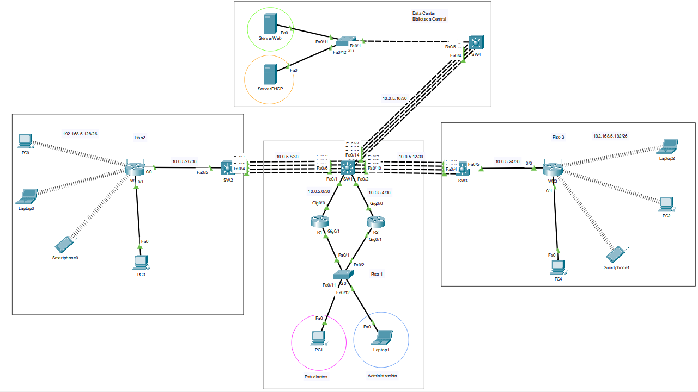
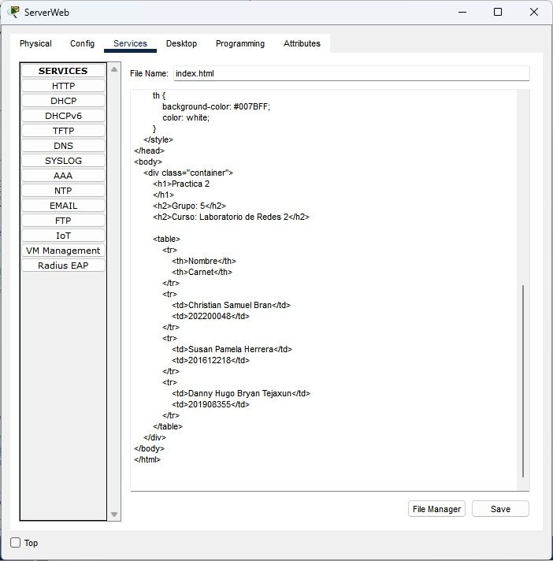
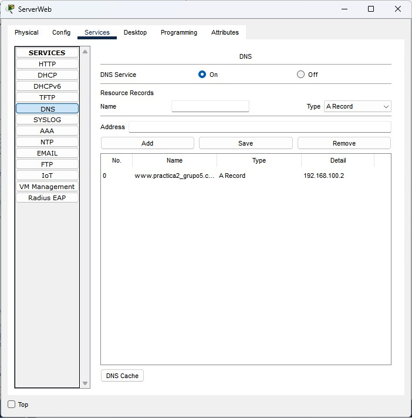
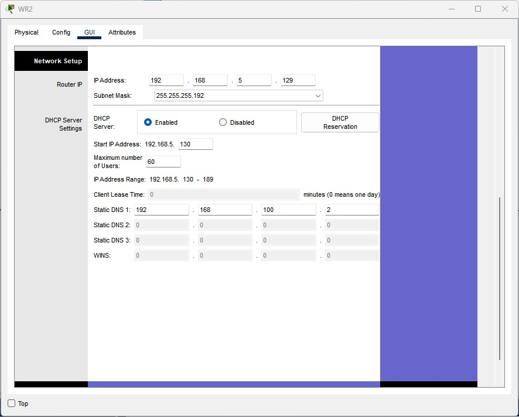
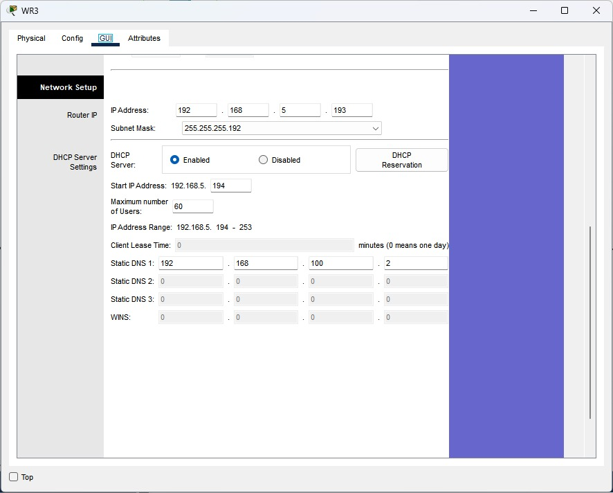
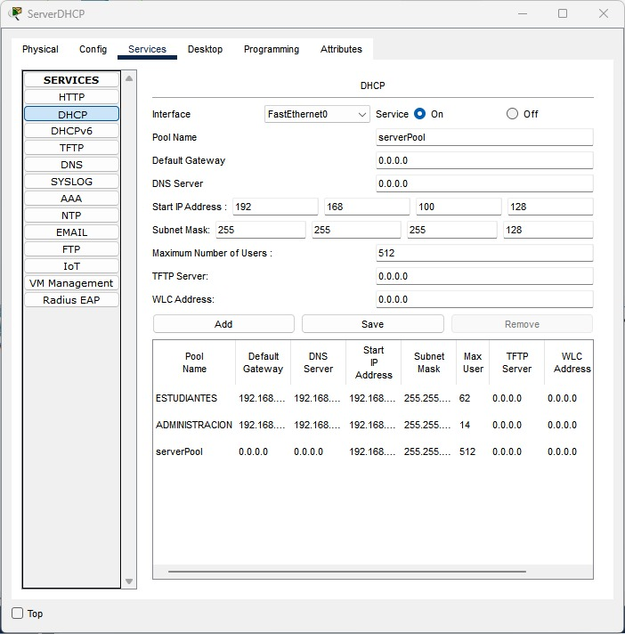

*Universidad de San Carlos de Guatemala*  
*Facultad de Ingenieria*  
*Escuela de Ciencias y Sistemas*  
*Redes De Computadoras 2*  
*Primer Semestre 2025*  
___
**202200048 - Christian Samuel Brán Mazariegos**  
**201908355 - Danny Hugo Bryan Tejaxún Pichiyá**  
**201612218 - Susan Pamela Herrera Monzón**  
___
## **Práctica 2**

### Topología



### Servidor web






### Subnetting
#### Pisos 1, 2 y 3
* `Red General: 192.168.5.0/24`

|Piso|Área|Hosts|ID Red|Default Gateway|Primera IP Utilizable|Última IP Utilizable|Broadcast|Máscara de Subred|
|-|-|-|-|-|-|-|-|-|
|1|Administración|10|192.168.5.0|192.168.5.1|192.168.5.2|192.168.5.14|192.168.5.15|255.255.255.240 `/28`|
|1|Estudiantes|60|192.168.5.64|192.168.5.65|192.168.5.66|192.168.5.126|192.168.5.127|255.255.255.192 `/26`|
|2|WLAN|60|192.168.5.128|192.168.5.129|192.168.5.130|192.168.5.190|192.168.5.191|255.255.255.192 `/26`|
|3|WLAN|60|192.168.5.192|192.168.5.193|192.168.5.194|192.168.5.254|192.168.5.255|255.255.255.192 `/26`|

#### Biblioteca Central
* `Red General: 192.168.100.0/24`

|Área|ID Red|Default Gateway|Primera IP Utilizable|Última IP Utilizable|Broadcast|Máscara de Subred|
|-|-|-|-|-|-|-|
|Servidor Web|192.168.100.0|192.168.100.1|192.168.100.2|192.168.100.126|192.168.100.127|255.255.255.128 `/25`|
|Servidor DHCP|192.168.100.128|192.168.100.129|192.168.100.130|192.168.100.254|192.168.100.255|255.255.255.128 `/25`|

#### Enrutamiento
* `Red General: 10.0.5.0/24`

|ID Red|Primera IP Utilizable|Última IP Utilizable|Broadcast|Máscara de Subred|
|-|-|-|-|-|
|10.0.5.0|10.0.5.1|10.0.5.2|10.0.5.3|255.255.255.252 `/30`|
|10.0.5.4|10.0.5.5|10.0.5.6|10.0.5.7|255.255.255.252 `/30`|
|10.0.5.8|10.0.5.9|10.0.5.10|10.0.5.11|255.255.255.252 `/30`|
|10.0.5.12|10.0.5.13|10.0.5.14|10.0.5.15|255.255.255.252 `/30`|
|10.0.5.16|10.0.5.17|10.0.5.18|10.0.5.19|255.255.255.252 `/30`|
|10.0.5.20|10.0.5.21|10.0.5.22|10.0.5.23|255.255.255.252 `/30`|
|10.0.5.24|10.0.5.25|10.0.5.26|10.0.5.27|255.255.255.252 `/30`|
|10.0.5.28|10.0.5.29|10.0.5.30|10.0.5.31|255.255.255.252 `/30`|
|10.0.5.32|10.0.5.33|10.0.5.34|10.0.5.35|255.255.255.252 `/30`|
|10.0.5.36|10.0.5.37|10.0.5.38|10.0.5.39|255.255.255.252 `/30`|
|10.0.5.40|10.0.5.41|10.0.5.42|10.0.5.43|255.255.255.252 `/30`|

### IPs
#### Enrutamiento

* SW1
    * LACP: Port-Channel `Fa0/3-6`
    * LACP: Port-Channel `Fa0/7-10`
    * LACP: Port-Channel `Fa0/11-14`

|Interface|IP|Máscara de Subred|
|-|-|-|
|`Fa0/1`|10.0.5.1|255.255.255.252 `/30`|
|`Fa0/2`|10.0.5.5|255.255.255.252 `/30`|
|`Fa0/3`|10.0.5.9|255.255.255.252 `/30`|
|`Fa0/4`|||
|`Fa0/5`|||
|`Fa0/6`|||
|`Fa0/7`|10.0.5.13|255.255.255.252 `/30`|
|`Fa0/8`|||
|`Fa0/9`|||
|`Fa0/10`|||
|`Fa0/11`|10.0.5.17|255.255.255.252 `/30`|
|`Fa0/12`|||
|`Fa0/13`|||
|`Fa0/14`|||

* SW2
    * LACP: Port-Channel `Fa0/1-4`

|Interface|IP|Máscara de Subred|
|-|-|-|
|`Fa0/1`|10.0.5.10|255.255.255.252 `/30`|
|`Fa0/2`|||
|`Fa0/3`|||
|`Fa0/4`|||
|`Fa0/5`|10.0.5.21|255.255.255.252 `/30`|

* SW3
    * LACP: Port-Channel `Fa0/1-4`

|Interface|IP|Máscara de Subred|
|-|-|-|
|`Fa0/1`|10.0.5.14|255.255.255.252 `/30`|
|`Fa0/2`|||
|`Fa0/3`|||
|`Fa0/4`|||
|`Fa0/5`|10.0.5.25|255.255.255.252 `/30`|

* SW4

 * LACP: Port-Channel `Fa0/1-4`

|Interface|IP|Máscara de Subred|
|-|-|-|
|`Fa0/1`|10.0.5.18|255.255.255.252 `/30`|
|`Fa0/2`|||
|`Fa0/3`|||
|`Fa0/4`|||

* R1

|Interface|IP|Máscara de Subred|
|-|-|-|
|`Gi0/0`|10.0.5.2|255.255.255.252 `/30`|

* R2

|Interface|IP|Máscara de Subred|
|-|-|-|
|`Gi0/0`|10.0.5.6|255.255.255.252 `/30`|

### LACP
* SW1
```sh
enable
configure terminal
interface Fa0/1
no switchport
ip address 10.0.5.1 255.255.255.252
no shutdown
exit
interface Fa0/2
no switchport
ip address 10.0.5.5 255.255.255.252
no shutdown
exit
interface range Fa0/3-6
channel-group 1 mode active
exit
interface Port-channel1
no switchport
ip address 10.0.5.9 255.255.255.252
no shutdown
exit
interface range Fa0/7-10
channel-group 2 mode active
exit
interface Port-channel2
no switchport
ip address 10.0.5.13 255.255.255.252
no shutdown
exit
interface range Fa0/11-14
channel-group 3 mode active
exit
interface Port-channel3
no switchport
ip address 10.0.5.17 255.255.255.252
no shutdown
exit
exit
write memory
```

* SW2
```sh
enable
configure terminal
interface range Fa0/1-4
channel-group 1 mode active
exit
interface Port-channel1
no switchport
ip address 10.0.5.10 255.255.255.252
no shutdown
exit
interface Fa0/5
no switchport
ip address 10.0.5.21 255.255.255.252
no shutdown
exit
exit
write memory
```

* SW3
```sh
enable
configure terminal
interface range Fa0/1-4
channel-group 2 mode active
exit
interface Port-channel2
no switchport
ip address 10.0.5.14 255.255.255.252
no shutdown
exit
interface Fa0/5
no switchport
ip address 10.0.5.25 255.255.255.252
no shutdown
exit
exit
write memory
```

* SW4
```sh
enable
configure terminal
interface range Fa0/1-4
channel-group 3 mode active
exit
interface Port-channel3
no switchport
ip address 10.0.5.18 255.255.255.252
no shutdown
exit
ip routing
interface Vlan 35
ip address 192.168.100.1 255.255.255.128
no shutdown
exit
interface Vlan 45
ip address 192.168.100.129 255.255.255.128
no shutdown
exit
exit
write memory
```

* R1
```sh
enable
configure terminal
interface Gi0/0
ip address 10.0.5.2 255.255.255.252
no shutdown
exit
exit
write memory
```

* R2
```sh
enable
configure terminal
interface Gi0/0
ip address 10.0.5.6 255.255.255.252
no shutdown
exit
exit
write memory
```

* WR2
```sh
enable
configure terminal
interface Internet
ip address 10.0.5.22 255.255.255.252
no shutdown
exit
exit
write memory
```

* WR3
```sh
enable
configure terminal
interface Internet
ip address 10.0.5.26 255.255.255.252
no shutdown
exit
exit
write memory
```

### EIGRP
* SW1
```sh
enable
configure terminal
ip routing
router eigrp 10
network 10.0.5.0 0.0.0.3
network 10.0.5.4 0.0.0.3
network 10.0.5.8 0.0.0.3
network 10.0.5.12 0.0.0.3
network 10.0.5.16 0.0.0.3
exit
exit
wr
```

* SW2
```sh
enable
configure terminal
ip routing
router eigrp 10
network 10.0.5.8 0.0.0.3
network 10.0.5.20 0.0.0.3
exit
exit
wr
```

* SW3
```sh
enable
configure terminal
ip routing
router eigrp 10
network 10.0.5.12 0.0.0.3
network 10.0.5.24 0.0.0.3
exit
exit
wr
```

* SW4
```sh
enable
configure terminal
ip routing
router eigrp 10
network 10.0.5.16 0.0.0.3
network 192.168.100.0 0.0.0.127
network 192.168.100.128 0.0.0.127
exit
exit
wr
```

* R1
```sh
enable
configure terminal
ip routing
router eigrp 10
network 10.0.5.0 0.0.0.3
network 192.168.5.0 0.0.0.15
network 192.168.5.64 0.0.0.63
exit
exit
wr
```

* R2
```sh
enable
configure terminal
ip routing
router eigrp 10
network 10.0.5.4 0.0.0.3
network 192.168.5.0 0.0.0.15
network 192.168.5.64 0.0.0.63
exit
exit
wr
```
### HSRP

* R1
```sh
enable
configure terminal
interface gi0/1
no shutdown
interface gi0/1.15
encapsulation dot1q 15
ip address 192.168.5.2 255.255.255.240
ip helper-address 192.168.100.130
standby 1 ip 192.168.5.1
standby 1 priority 150
standby 1 preempt
exit
interface gi0/1.25
encapsulation dot1q 25
ip address 192.168.5.66 255.255.255.192
ip helper-address 192.168.100.130
standby 2 ip 192.168.5.65
standby 2 priority 150
standby 2 preempt
exit
exit
wr
```

* R2
```sh
enable
configure terminal
interface gi0/1
no shutdown
interface gi0/1.15
encapsulation dot1q 15
ip address 192.168.5.3 255.255.255.240
standby 1 ip 192.168.5.1
standby 1 priority 100
standby 1 preempt
exit
interface gi0/1.25
encapsulation dot1q 25
ip address 192.168.5.67 255.255.255.192
standby 2 ip 192.168.5.65
standby 2 priority 100
standby 2 preempt
exit
exit
wr
```

### VLAN
|VLAN|ID|
|-|-|
|ADMIN|15|
|ESTUDIANTES|25|
|WEB_SERVERS|35|
|DHCP_SERVERS|45|

* S0
```sh
enable
configure terminal
vlan 15
name ADMIN
exit
vlan 25
name ESTUDIANTES
exit
vlan 35
name WEB_SERVERS
exit
vlan 45
name DHCP_SERVERS
exit
exit
wr
show vlan
```

* S1
```sh
enable
configure terminal
vlan 35
name WEB_SERVERS
exit
vlan 45
name DHCP_SERVERS
exit
exit
wr
show vlan
```

### Modo Troncal
* S0
```sh
enable
configure terminal
interface range F0/1-2
switchport mode trunk
switchport trunk allowed vlan 15,25
exit
exit
wr
```

* S1
```sh
enable
configure terminal
interface F0/1
switchport mode trunk
switchport trunk allowed vlan 35,45
exit
exit
wr
```

### Modo Acceso
* S0
```sh
enable
configure terminal
interface F0/11
switchport mode access
switchport access vlan 25
exit
interface F0/12
switchport mode access
switchport access vlan 15
exit
exit
wr
```

* S1
```sh
enable
configure terminal
interface F0/11
switchport mode access
switchport access vlan 35
exit
interface F0/12
switchport mode access
switchport access vlan 45
exit
exit
wr
```

### Pools DHCP






